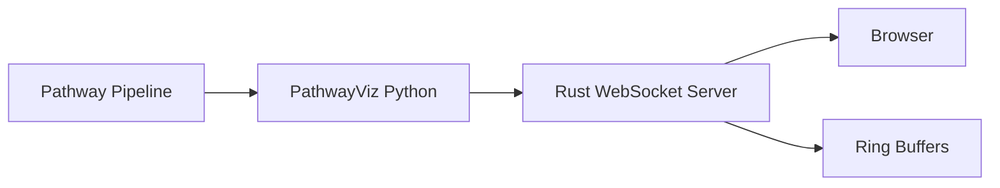
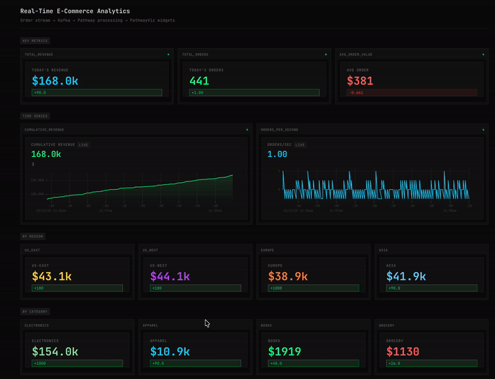

# PathwayViz

Real-time dashboards for streaming pipelines. No frontend code required.

Build once in Python, then:

- run a live dashboard at `http://localhost:3000`
- embed individual live widgets in your app via iframes at `http://localhost:3000/embed/{widget_id}`

[](https://pypi.org/project/pathway-viz/)
[](https://opensource.org/licenses/MIT)

## The Problem

You're building a streaming pipeline. You want a dashboard to see what's happening. Your options:

1. **Jupyter notebooks** — Great for exploration, but you can't deploy them or embed them in your app
2. **Grafana/Prometheus** — Works, but now you need to set up metrics exporters, another service, learn PromQL
3. **Build a React app** — Now you're maintaining frontend code, WebSocket connections, state management

PathwayViz is a simpler option: add a few lines of Python, get a production-ready dashboard.

## How It Works

```python
import pathway as pw
import pathway_viz as pv

# Read from Kafka/Redpanda (or any Pathway source)
orders = pw.io.kafka.read(...)
totals = orders.reduce(revenue=pw.reducers.sum(pw.this.amount))

# Widgets auto-update when Pathway updates the table
pv.stat(totals, "revenue", title="Revenue", unit="$")
pv.start()
pw.run()
```

Run it, open [http://localhost:3000](http://localhost:3000), done.

```html
<iframe src="http://localhost:3000/embed/revenue"></iframe>
```

See [Embedding docs](./docs/embedding.md) for React and Svelte components.

## Architecture



The Rust server handles high-throughput WebSockets and caches recent history in ring buffers so new clients can instantly catch up.

## Why Rust?

PathwayViz uses a small Rust extension module (built with `pyo3`) for the hot path:

- WebSocket fan-out to many browser clients (Tokio + Axum)
- in-memory ring buffers for recent history per widget
- serving the embedded frontend assets from the binary

This keeps the runtime responsive under load and avoids Python bottlenecks in the networking/event-loop layer.

## Demo



## Install

```bash
pip install pathway-viz
```

## Documentation

- [Getting Started](./docs/getting-started.md)
- [Widgets](./docs/widgets.md)
- [Embedding](./docs/embedding.md)
- [Deployment](./docs/deployment.md)
- [Concepts](./docs/concepts.md)

## Roadmap

- [x] Core widgets: stat, chart, gauge, table
- [x] Pathway integration
- [x] Embed mode for iframes
- [ ] Theme customization
- [ ] Prometheus metrics endpoint
- [ ] Authentication

## License

MIT
