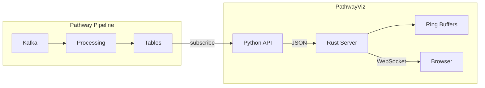

# PathwayViz

[](https://pypi.org/project/pathway-viz/)
[](https://opensource.org/licenses/MIT)

Embeddable real-time widgets for [Pathway](https://pathway.com/) streaming pipelines. Rust WebSocket server with a Python API.


## Overview

PathwayViz makes it easy to embed live-updating data from Kafka streams into any web page. Define widgets in Python, embed them via iframe anywhere.

```python
import pathway as pw
import pathwayviz as pv

orders = pw.io.kafka.read(...)
revenue = orders.reduce(revenue=pw.reducers.sum(pw.this.amount))

pv.stat(revenue, "revenue", title="Revenue", unit="$", embed=True)
pv.start()
pw.run()
```

```html
<iframe src="http://localhost:3000/embed/revenue"></iframe>
```

## Install

```bash
pip install pathway-viz
```

## Architecture



**Key components:**

- **Python API** - Widgets subscribe to Pathway tables via `pw.io.subscribe()` callbacks
- **Rust WebSocket Server** - Tokio async runtime handles concurrent connections without GIL contention
- **Ring Buffers** - New clients receive historical data immediately without replaying the stream
- **Embedded Frontend** - HTML/JS compiled into the binary, no external assets to serve

## Widgets

```python
# Single value with delta tracking
pv.stat(totals, "revenue", title="Revenue", unit="$", embed=True)

# Time series chart
pv.chart(windowed_data, "count", x_column="window_end", title="Orders/sec", embed=True)

# Circular gauge
pv.gauge(stats, "cpu", title="CPU", max_val=100, unit="%", embed=True)

# Live-updating table
pv.table(by_region, title="By Region", columns=["region", "revenue"], embed=True)
```

Each widget with `embed=True` is accessible at `/embed/{widget_id}`.

## Demo

Requires Docker (spins up Redpanda for Kafka):

```bash
pip install pathway-viz[kafka]
pathway-viz demo
```

Generates fake e-commerce orders and displays live metrics. Includes a portal page demonstrating embedded widgets in a mock storefront.

## Documentation

- [Getting Started](./docs/getting-started.md)
- [Widgets](./docs/widgets.md)
- [Embedding](./docs/embedding.md)
- [Deployment](./docs/deployment.md)

## Roadmap

- [x] Core widgets (stat, chart, gauge, table)
- [x] Pathway table subscriptions
- [x] Embed mode with per-widget endpoints
- [x] Ring buffer history for late-joining clients
- [ ] Additional chart types
- [ ] Crash recovery

## License

MIT
